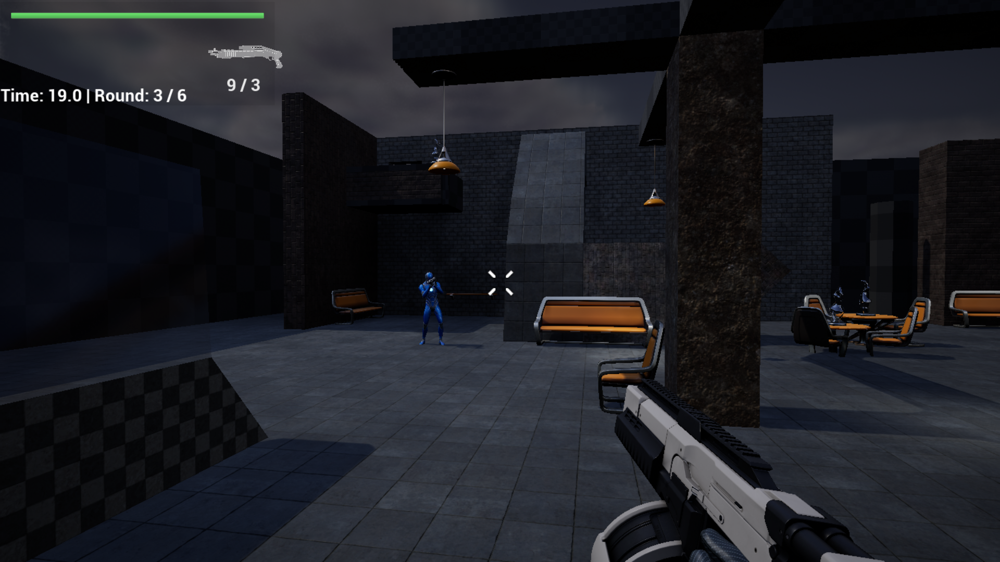
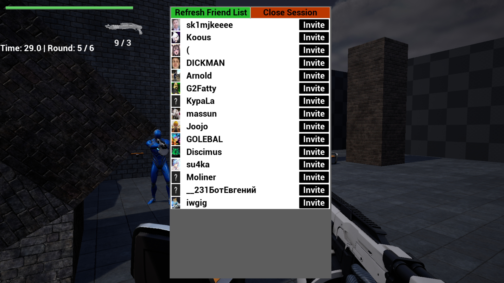
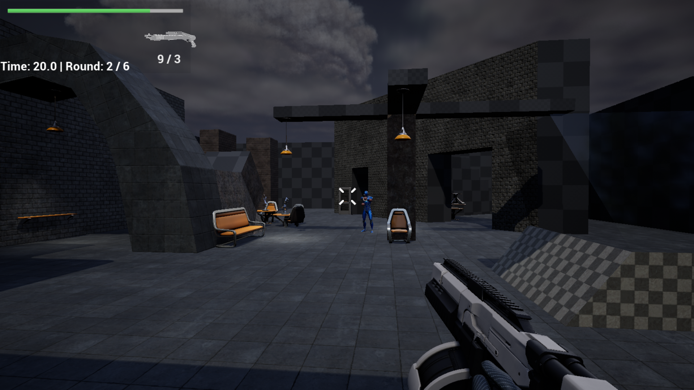
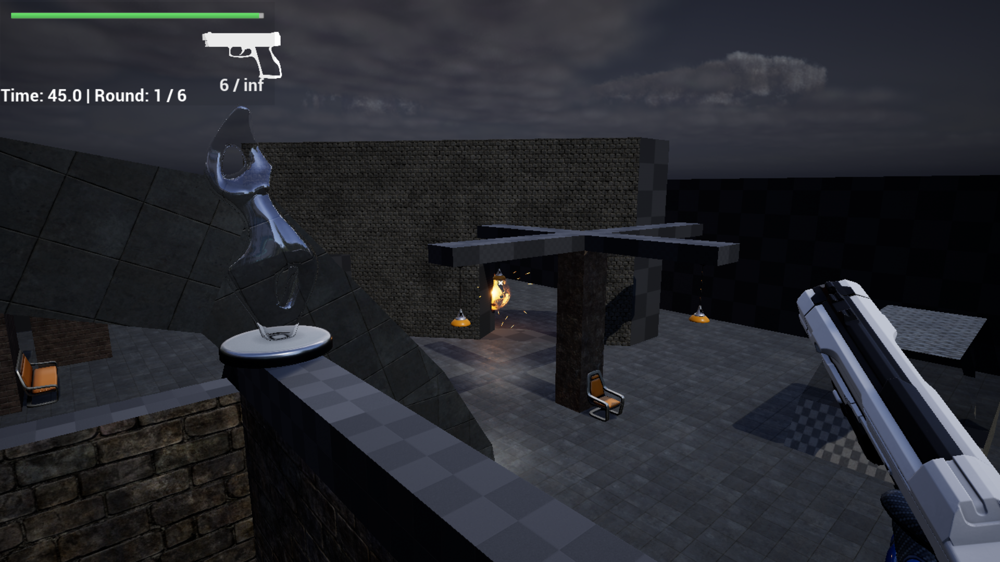

# TinyShooter

tinyshooter - is a Multiplayer Shooter Game written in C++ with Unreal Engine 5 and Steam API Advanced Sessions. This project is made for educational purposes during practice [iTechArt](https://itechartgroup.by/).

# Resources
This Demo Shooter contains assets from [Unreal Engine Lyra](https://github.com/EpicGames/UnrealEngine/tree/ue5-main/Samples/Games/Lyra).

The download binary is available here: [releases](https://github.com/Vention/TinyShooter/releases)

     
    
    
    

